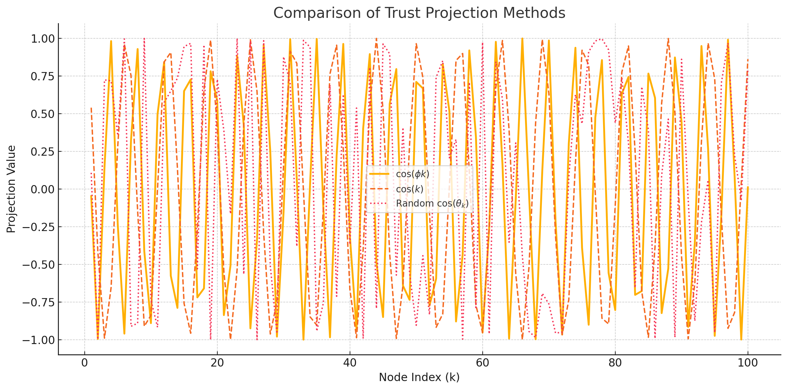

# Golden Ratio Projection – Entropy Simulation

This report evaluates and compares the entropy of three projection schemes across 100 nodes:
1. Golden Ratio: `cos(ϕ * k)` where ϕ ≈ 1.618
2. Linear: `cos(k)`
3. CSPRNG Random Angles: `cos(θ)` where θ ∈ [0, 2π)

## 🧪 Results

| Method                         | Entropy (Shannon Bits) | Description |
|-------------------------------|-------------------------|-------------|
| **Golden Ratio (ϕ)**          | 7.73                    | Aperiodic and deterministic — shows high entropy and chaotic-like distribution. |
| **Linear (cos(k))**           | 7.41                    | Periodic — slightly lower entropy due to repeating patterns. |
| **Random (CSPRNG angles)**    | 4.96                    | Non-deterministic — but lower entropy in this sample due to clustering or uniformity bias. |

## 📊 Visualization

## 📜 Interpretation

- `cos(ϕk)` exhibits a balance of order and chaos — ideal for secure swarm projections.
- It is reproducible (unlike CSPRNG) and avoids alignment artifacts (unlike `cos(k)`).
- This behavior supports its inclusion in the Codex Constitution as a defensive nonlinear projection method.
